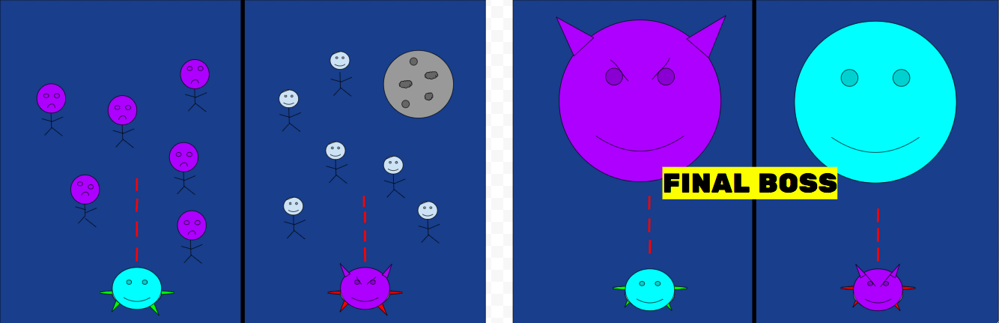

# Astronauts VS Aliens: An Exciting Two-Player Shooting Game!
Welcome to Astronauts VS Aliens! This is an instruction guide to teach you how to play, so that you can have a great time! :)

## Objective of the game
A new planet, currently named Planet Phoque, has just been discovered in deep space. It has habitable conditions, oxygen, and gravity extremely similar to Earth's. Humans from Earth are looking to colonize the planet and set up camps -- to finally fulfill a long-awaited dream of living in space! However, a new species of alien has also emerged from their home planet, hoping to claim the planet to set up an energy generation center. A full out war has started, with neither species willing to back down. 

Both sides have agreed: whoever wins the war wins all rights to the planet!

One player is an **astronaut** who's just been sent out from Earth to defeat the **aliens**. 
The other player is an **alien** who's needs to defeat as many **astronauts** as possible!

## Gameplay Instructions
The **astronaut** player controls their spaceship with W, A, and D. 
A and D are to move left and right, and the W key is for shooting lasers out of the spaceship.

The **alien** player controls their spaceship with the LEFT, RIGHT, and UP arrow keys. 
LEFT and RIGHT are to move left and right, and the UP key is for shooting lasers out of the spaceship.

You earn points by hitting various objects that fly in your way, whether that be enemies or other special objects.

The goal of the game is to **score the most points**, or to **survive longer than the other player**. Whoever does this wins, and gets full rights to Planet Phoque for their species!

## Scoring 
* All aliens/humans hit: **+ 10 points** each.
* Hitting a rare shooting star: **+ 15 points** each, and you get back a life!
* Ouch! If a meteor hits your spaceship: **you lose one life (one of your hearts)!**.
* If you lose all three of your lives, **you lose!** The game ends and the other player wins.
* Near the end of the game, a giant face of the enemy side will appear on your side of the screen. This is the final stage that makes or breaks a close game, and you can earn **+ 10 points** every single time you shoot this face. Spam those bullets!

## Functionality and Limitations
### Functionality
* To start the game, one player must press the ***space*** key at the beginning. 
* To pause the game anytime during gameplay, press the ***esc*** key. To restart the game, press ***space***.
* The **astronaut** player moves left and right with A and D; shoots lasers with W
* The **alien** player moves left and right with LEFT and RIGHT; shoots lasers with UP

### Limitations
* Each character's spaceship is restricted to their side of the screen: the human spaceship on the left side, and the alien spaceship on the right. Neither can pass the black barrier in the middle of the screen.
* The key must be pressed repeatedly to result in bullets being shot -- it cannot be held in place, as only one bullet will come out.
* To restart the game, the game must be reloaded, which will bring you to the title screen.

## Screen Mock-Ups

* The screen will be about 1000 by 750, to create a rectangle
* It will be multiplayer, with either player restricted to one side (about 500 by 375 per side)
* Aliens and astronauts will fall from the sky at random, and players will control spaceships to shoot the aliens/astronauts
* There will be a barrier in the middle, about 10 units wide, to separate the sides
* Near the end of the game, there will be a giant enemy for players to shoot, that will give points every time it is shot!

# Good luck everyone, and Have Fun!
